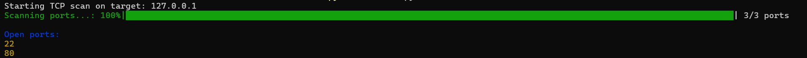
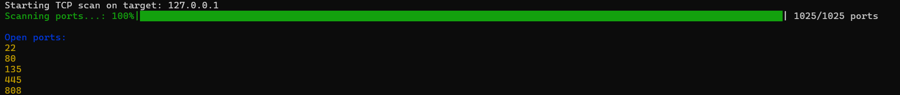

# Network Scanner Tool Documentation

## Table of Contents
1. [Project Overview](#project-overview)
2. [Installation](#installation)
3. [Usage](#usage)
4. [Technical Implementation](#technical-implementation)
5. [Examples](#examples)
6. [Security Considerations](#security-considerations)

## Project Overview📝
The Network Scanner Tool is a lightweight, command-line network reconnaissance utility built using Scapy. Designed for network administrators, security professionals, and ethical researchers, the tool provides a flexible mechanism for identifying open ports on target systems through TCP SYN scanning.

### Key Features
- TCP port scanning
- Colorful console output
- Progress bar visualization
- Flexible port scanning (specific ports or ranges)
- Precise and efficient scanning mechanism

## Installation⚙️

### Prerequisites
- Python 3.7+
- Root/Administrator privileges
- Network connectivity

### Step-by-Step Installation
1. **Clone the Repository**:
```bash
git clone https://github.com/RobCyberLab/Network-Scanner-Tool.git
cd network-scanner-tool
```

2. **Install Required Dependencies**:
```bash
pip install scapy tqdm colorama
```

### Required Libraries
- `scapy`: Packet manipulation and network scanning
- `tqdm`: Progress bar visualization
- `colorama`: Colored console output
- `argparse`: Command-line argument parsing

## Usage📖

### Basic Scanning Modes

#### Scan Specific Ports
```bash
python scanner.py TCP 127.0.0.1 22 80 443
```
- Scans ports 22, 80, and 443 on the target IP

#### Scan Port Range
```bash
python scanner.py TCP 127.0.0.1 0 1000 --range
```
- Scans all ports from 0 to 1000 on the target IP

### Command-Line Options
- `TCP`: Specifies TCP scanning mode
- `target`: IP address or hostname to scan
- `ports`: List of ports or port range to scan
- `--range`: Indicates scanning a continuous port range

## Technical Implementation🔧

### Scanning Mechanism
```python
def tcp_scan(target, ports, port_range=False):
    # Create port range if specified
    if port_range:
        ports = range(low_port, high_port + 1)
    
    # Craft SYN packets for each port
    tcp_packet = IP(dst=target) / TCP(dport=port, flags="S")
    
    # Send packet and analyze response
    response = sr1(tcp_packet, timeout=1, verbose=False)
```

### Key Technical Components
- **SYN Scanning**: Half-open TCP scanning technique
- **Packet Crafting**: Dynamic packet generation using Scapy
- **Response Analysis**: Identifies open ports based on TCP flag response
- **Progress Visualization**: Real-time scanning progress with `tqdm`
- **Colorful Output**: Enhanced console readability with `colorama`

### Scan State Detection
- `SA` (SYN-ACK) flags indicate an open port
- Timeout or no response suggests closed or filtered ports

## Examples📌

### Example 1: Scanning Common Ports
```bash
python scanner.py TCP 127.0.0.1 22 80 443
```

<p align="center">
  
  <br>
  <em>Scanning Common Ports</em>
</p>

### Example 2: Comprehensive Port Range Scan
```bash
python scanner.py TCP 127.0.0.1 0 1024 --range
```

<p align="center">
  
  <br>
  <em>Comprehensive Port Range Scan</em>
</p>

### Test Tricks

For Testing purposes we can start a simple HTTP server as follows:

```bash
python -m http.server 80
```

Expected Output:
```bash
Serving HTTP on :: port 80 (http://[::]:80/) ...
```

## Security Considerations⚖️

### Ethical Usage
🚨 **Important**:
- Only scan networks you own or have explicit permission to test
- Unauthorized network scanning may be illegal
- Respect network usage policies and privacy

### Best Practices
- Always obtain proper authorization
- Use the tool for legitimate network management
- Avoid scanning production or sensitive networks
- Comply with local and international cybersecurity regulations

## Potential Improvements🚀
- Add UDP scanning support
- Implement OS fingerprinting
- Create detailed JSON/CSV reporting
- Add banner grabbing capabilities
- Optimize scanning performance
- Enhance stealth scanning techniques
